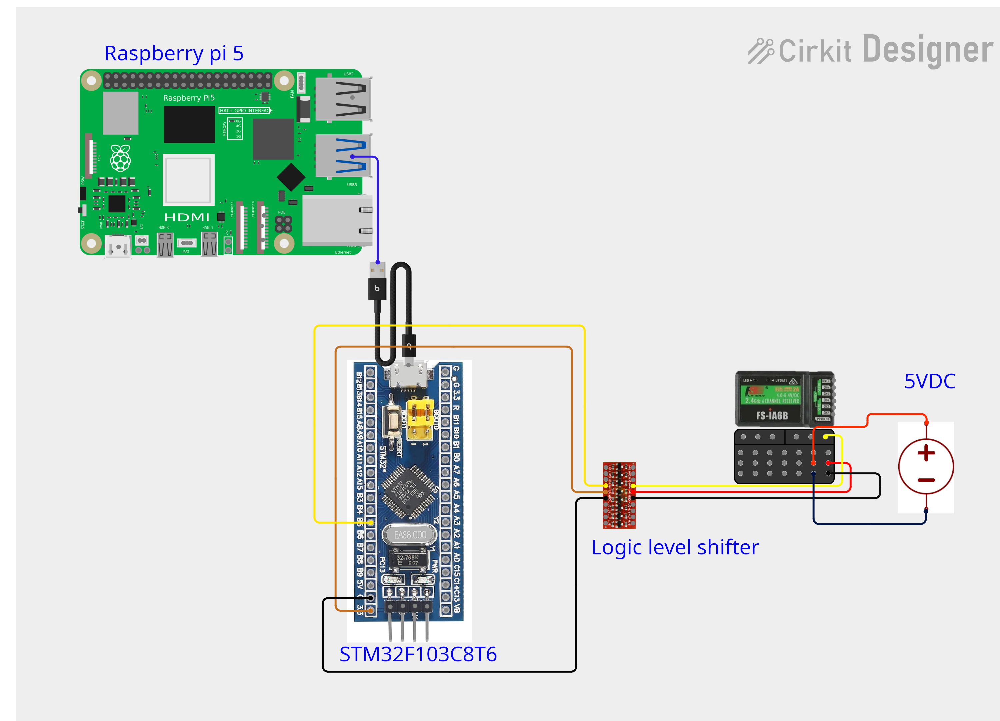

# Veddar VESC Interface
 This repo is originally from origin	https://github.com/f1tenth/vesc.git (fetch)


Packages to interface with Veddar VESC motor controllers. See https://vesc-project.com/ for details

This is a ROS2 implementation of the ROS1 driver using the new serial driver located in [transport drivers](https://github.com/ros-drivers/transport_drivers).

tested on Ubuntu 22.04, ROS2 humble, jazzy

## How to test

1. Clone this repository and [transport drivers](https://github.com/ros-drivers/transport_drivers) into `src`.
2. `rosdep update && rosdep install --from-paths src -i -y`
3. Plug in the VESC with a USB cable.
4. Modify `vesc/vesc_driver/params/vesc_config.yaml` to reflect any changes.
5. Build the packages `colcon build`
6. 
```
ros2 launch vesc_driver vesc_driver_node.launch.py
```

7. If prompted "permission denied" on the serial port,
then

```
sudo chmod 777 /dev/ttyACM0
```

Commands

```
ros2 launch vesc_driver vesc_driver_node.launch.py 
ros2 topic echo /sensors/core
ros2 topic pub /commands/motor_master/duty_cycle std_msgs/msg/Float64 "{data: 0.3}"
ros2 topic pub /commands/motor_slave/speed std_msgs/msg/Float64 "{data: 3000}"
ros2 topic pub /commands/motor_master/current std_msgs/msg/Float64 "{data: 1.2}"
```

```
ros2 topic list
/commands/motor_master/brake
/commands/motor_master/current
/commands/motor_master/duty_cycle
/commands/motor_master/speed
/commands/motor_slave/brake
/commands/motor_slave/current
/commands/motor_slave/duty_cycle
/commands/motor_slave/speed
/commands/servo/position
/parameter_events
/rosout
/sensors/core
/sensors/imu
/sensors/imu/raw
/sensors/servo_position_command
```

## Diff drive

Terminal 1

```
ros2 launch vesc_driver vesc_driver_node.launch.py 
```

Terminal 2

```
ros2 launch vesc_diff_drive vesc_diff_drive.launch.py
```

Terminal 3

```
ros2 topic pub /cmd_vel geometry_msgs/msg/Twist "{linear: {x: 1.0, y: 0.0, z: 0.0}, angular: {x: 0.0, y: 0.0, z: 0.0}}" --rate 10
ros2 topic pub /cmd_vel geometry_msgs/msg/Twist "{linear: {x: 0.0, y: 0.0, z: 0.0}, angular: {x: 0.0, y: 0.0, z: 1.0}}" --rate 10
```

## ROS bag

Terminal 1

```
ros2 bag record -o boat_test_01 /sensors/core /image_raw/compressed
```

after record completion, then play with

```
ros2 bag play boat_test_01
```

use rviz2 or other visualization to see the playing topics
TODO

- currently slave can_id is hardcoded to 62, change that
- topic like break,position,current need to have master, slave


# Universal RC-Joystick to ROS 2 using STM32 Blue Pill

คู่มือการเปลี่ยน STM32F103C8T6 (Blue Pill) ให้เป็น Joystick สำหรับรับสัญญาณจาก RC Receiver และส่งต่อไปยัง ROS 2 ผ่าน Topic `/joy`

---

## 🛠️ อุปกรณ์ที่ต้องใช้

1. บอร์ด STM32F103C8T6 (Blue Pill) x 1
2. ST-Link V2 (สำหรับอัปโหลด Firmware) x 1
3. RC Receiver (5V PWM Output) x 1
4. RC Transmitter (รีโมทบังคับ) x 1
5. Logic Level Converter (Bi-directional 5V to 3.3V) x 1
6. สาย USB-C (สำหรับจ่ายไฟและสื่อสารกับ PC)
7. สายจั๊มเปอร์ตัวผู้-ตัวเมีย และตัวผู้-ตัวผู้

---

## 📂 ไฟล์ที่ต้องเตรียม
*   `firmware_f103c6.hex` (ไฟล์ที่ทำให้ STM32 เป็น USB Joystick)
*   `st-flash` (ติดตั้งผ่านคำสั่ง: `sudo apt install stlink-tools`)

---

## 1. Installation / Flash of Universal-RC-Joystick to STM32 Blue Pill

### 1.1 ST-Link V2 Connection
เสียบสาย ST-Link V2 เข้ากับบอร์ด STM32 ตามตารางด้านล่าง:

| ST-Link Pin | STM32 Blue Pill Pin |
| :--- | :--- |
| 3.3V | 3.3V |
| GND | GND |
| SWDIO | SWDIO |
| SWCLK | SWCLK |

> ⚠️ **ข้อควรระวัง:** ตรวจสอบขา `SWDIO` และ `SWCLK` ให้ตรงกัน ห้ามสลับขาเด็ดขาด

### 1.2 Jumper Configuration (BOOT0, BOOT1)
*   **ในขั้นตอนการ Flash:** set Jumper BOOT0=1, BOOT1 = 0 
*   **หลังจาก Flash เสร็จ:**  set Jumper BOOT0=1, BOOT1 = 0 

### 1.3 Flashing Command
เปิด Terminal และรันคำสั่งต่อไปนี้ (ในโฟลเดอร์ที่มีไฟล์ `firmware_f103c6.hex`):

```bash
st-flash --format ihex write firmware_f103c6.hex
```

#### ผลลัพธ์ที่คาดหวัง:

```
Flash written and verified! jolly good!
```

# 1.3.1 Test Installation Completed (Check via Linux)

หลังจาก Flash เสร็จ ให้ถอด ST-Link ออก แล้วเสียบสาย USB-C เข้ากับบอร์ดและคอมพิวเตอร์ เพื่อทดสอบว่า Linux จดจำบอร์ดเป็น Joystick ได้หรือไม่:

1. ตรวจสอบ Kernel Log (เพื่อดูการเชื่อมต่อ):

```
dmesg | tail -20
```

(ควรเห็นข้อความเกี่ยวกับ USB Full-Speed device โดยไม่มี Error -32 หรือ -71)

2. ตรวจสอบ USB Device ID:

```
lsusb
```

(ควรเห็นรายการ ID 0483:5710 STMicroelectronics Joystick in FS Mode)

3. ตรวจสอบไฟล์อุปกรณ์ Joystick:

```
ls -l /dev/input/js*
```

(ควรเห็น /dev/input/js0 ปรากฏขึ้น)

---

# 2. Using STM32 as Joystick (Connecting to RC Receiver)

## 2.1 Wiring to RC Receiver (Text Diagram)

⚠️ Crucial Rule: STM32 รับสัญญาณได้สูงสุด 3.3V แต่ RC Receiver ส่งสัญญาณออกมาที่ 5V ห้ามต่อสัญญาณโดยตรงเด็ดขาด! ต้องใช้ Logic Level Converter และต้องต่อ GND ร่วมกันทุกตัว

(💡 แนะนำ: ถ่ายรูปการต่อสายจริงของคุณ แปะไว้ในส่วนนี้ เช่น )

🔌 การต่อสายด้วย Text Diagram:

การต่อ GND (จำเป็นที่สุด):
ต่อ GND ของ RC Receiver ➔ GND (Level Shifter High Side) ➔ GND (Level Shifter Low Side) ➔ GND (STM32) ให้ครบวงจร

ตารางการต่อสายจริง:

markdown

| สายจาก RC Receiver | Level Shifter (High Side) | Level Shifter (Low Side) | ขา STM32 (3.3V) |
| :--- | :--- | :--- | :--- |
| **VCC (Red)** | **HV** (VCC High) | - | - |
| **GND (Black)** | **GND** | **GND** | **GND** |
| **Signal 1 (White)** | **HV1** (Signal High) | **LV1** (Signal Low) | **PB5** (หรือ PA0) |
| - | - | **LV** (VCC Low) | **3.3V** |

> **Jumper (BOOT0, BOOT1):** ต้องถอด Jumper สีเหลืองออกให้หมด (BOOT0=0) เพื่อให้บอร์ดรันโปรแกรมตามปกติ

---

## 2.2 ROS 2 Joy Node Setup

เมื่อต่อสายเสร็จและเปิด Transmitter แล้ว ให้เปิด ROS 2 Joy Node:

```
sudo apt install ros-${ROS_DISTRO}-joy
ros2 run joy joy_node
```

---

## 2.3 Test with RC Transmitter

เปิด Terminal ใหม่อีกหน้าต่าง เพื่อดูข้อมูลแบบ Real-Time:

```
ros2 topic echo /joy
```

การทดสอบ:
- เปิด RC Transmitter (ตรวจสอบแบต > 1.4V ต่อก้อน)
- ขยับคันบังคับ (Stick): ควรเห็นค่าใน axes[0] ถึง axes[3] เปลี่ยนจาก 0.0 ไปเป็น 1.0 หรือ -1.0
- กดสวิตช์ (Switch): ควรเห็นค่าใน buttons[...] เปลี่ยนเป็น 1

---

## 2.4 Converting Joy to Teleop (/cmd_vel)

เพื่อนำค่าไปควบคุมหุ่นยนต์จริง ให้แปลงข้อมูลจาก /joy ไปเป็น /cmd_vel:

```
sudo apt install ros-${ROS_DISTRO}-teleop-twist-joy
ros2 run teleop_twist_joy teleop_node
```

และตรวจสอบคำสั่งความเร็ว:

```
ros2 topic echo /cmd_vel
```

---

## ⚠️ Troubleshooting (แนวทางการแก้ไขปัญหา)


| อาการที่พบ 🚨 | สาเหตุที่เป็นไปได้ 🔍 | วิธีแก้ไข 🛠️ |
| :--- | :--- | :--- |
| `dmesg` แสดง **Error -32** | สาย USB ไม่ดี หรือบอร์ด Reset ไม่ทัน | เปลี่ยนสาย USB, กด **Reset** ใหม่ แล้วเสียบสายใหม่ |
| `lsusb` **ไม่เห็น** `0483:5710` | Flash ไม่สำเร็จ หรือ Jumper `BOOT0=0` ไม่ได้ | รัน `st-flash` ใหม่, **ถอด Jumper สีเหลือง** ออกให้หมด |
| `/dev/input/js0` **ไม่พบ** | ระบบยังไม่รู้จักอุปกรณ์ Joystick | ถอด-เสียบ USB ใหม่, กดปุ่ม **Reset** ค้างไว้ 1 วินาที แล้วปล่อย |
| `ros2 topic echo /joy` **ไม่มีข้อมูล** | `joy_node` ยังไม่เปิดทำงาน | เปิด Terminal แล้วรัน `ros2 run joy joy_node` **ทิ้งไว้** |
| ค่า `axes` **ค้างที่ 0.0** | Transmitter แบตหมด หรือสัญญาณขาด | เปลี่ยนแบต Tx **(1.5V)**, เปิด-ปิดสวิตช์ Tx ใหม่ |
| สัญญาณ `axes` **กระตุก/รวน** | GND หลุดหรือต่อไม่ครบวงจร | ตรวจสอบ GND ระหว่าง Rx, Level Shifter และ STM32 **ให้ครบทุกจุด** |
---

## 📌 Credits & License

Firmware: firmware_f103c6.hex (USB HID Joystick firmware for STM32F103) from https://github.com/Cleric-K/Universal-RC-Joystick

Flashing Tool: st-link / stlink-tools
ROS 2 Packages: joy, teleop_twist_joy